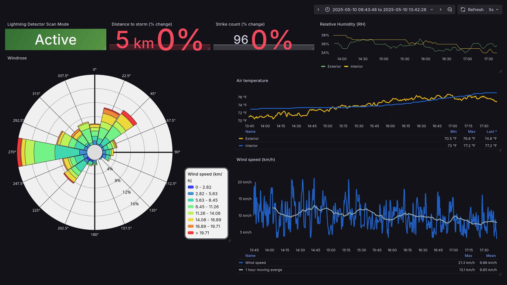

# Sail WX

This is not a deployable version of this project, it is framework and publicly available for viewing in case documentation on a deployed platform is required.

> [!NOTE]
> Note many places that reference credentials/credential variables are blank 

[Narrative on my static site](https://tom.mcnulty.in/sail-wx)

## Components

### Docker Compose

The docker compose file will bring up an Influx, Grafana, and Chronograf instance. Chronograf may not be strictly necessary but can be useful while troubleshooting measurement operations while setting up.

These containers are needed at system startup so that the clients can connect to both insert measurements and display the current data. This can be created by running the cdcs.sh (Create Docker Compose Systemd) script. It is a small template that will populate a Unit file with the compose configuration in the working directory the script is run with. The compose.yml must be co-located.

The grafana-provisioning folder is an interesting intricacy. I believe it's used to install third-party plugins, if not, you'll have to uncomment the operato windrose line in the compose configuration itself. 

### Librewolf

There are no lightweight browsers anymore, but a static build of librewolf is about as stripped as you can get. I do not have a list of the specific extensions used for this implementation, but librewolf will not remember the screen resolution/size on startup, and thus needs an extension like [ForceFull](https://addons.mozilla.org/en-US/firefox/addon/forcefull/) to maximize on startup. Librewolf is started by the small startup.sh script so that a 10 second delay can be used to give time for the docker containers and measurement gathering services to start. 

### rtl_433

[rtl_433](https://github.com/merbanan/rtl_433) decodes the weather chirps and directly inserts into the Influx series. It needs a systemd unit service and to start on startup. An SDR dongle is required. Beware of imitators, and of RFI.

The influx433.service should be placed in the user's .config/systemd directory and linked to default-target.wants. 

### 3D Models/Packaging

If you want to build a very similar package, the model files for VESA mount and dongle retainer are included, and also available on [Printables](https://www.printables.com/model/1357267-intel-nuc-vesa-mount-with-rtl-sdr-cage).

